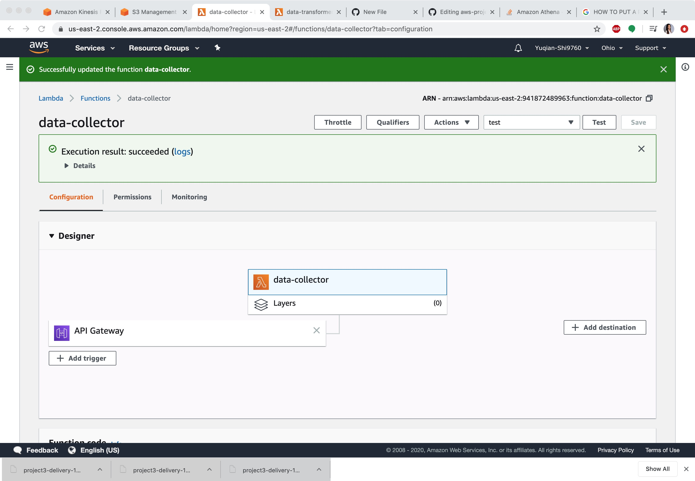
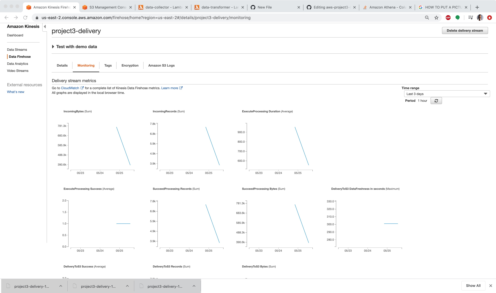

## Streaming Finance Data with AWS Lambda


## Data_Collector - lamda function URL
- API Endpoint:https://pm58nkoy6k.execute-api.us-east-2.amazonaws.com/default/data-collector
## Data_Collector - lambda function source code
- ```ruby data_collector.py```
```ruby
import json
import boto3
import os
import subprocess
import sys

import os
import shutil
for root, dirs, files in os.walk('doo'):
    for f in files:
        os.unlink(os.path.join(root, f))
    for d in dirs:
        shutil.rmtree(os.path.join(root, d))
    

subprocess.check_call([sys.executable, "-m", "pip", "install", "--target", "/tmp", 'yfinance'])
sys.path.append('/tmp')

import yfinance as yf

tickers = ['FB', 'SHOP', 'BYND', 'NFLX', 'PINS', 'SQ', 'TTD', 'OKTA', 'SNAP', 'DDOG']
start = '2020-05-14'
end = '2020-05-15'

def lambda_handler(event, context):
    fh = boto3.client("firehose", "us-east-2")
    for ticker in tickers:
        data = yf.download(ticker, start=start, end=end, interval = "1m")
        for datetime, row in data.iterrows():
            output = {'name': ticker}
            output['high'] = row['High']
            output['low'] = row['Low']
            output['ts'] = str(datetime)
            as_jsonstr = json.dumps(output)
            fh.put_record(
                DeliveryStreamName="project3-delivery", 
                Record={"Data": as_jsonstr.encode('utf-8')})
    return {
        'statusCode': 200,
        'body': json.dumps(f'Done! Recorded: {as_jsonstr}')
    }
```


----

## DataTransformer
- Monitoring



----


## DataSnalyzer
- ```ruby query.sql```

```
SELECT t.name,
        t.hour,
        t.highest,
        i.ts
FROM 
    (SELECT name,
         max(high) AS highest,
         hour
    FROM 
        (SELECT name,
         high,
         ts,
         substring(ts,
         12,
         2) AS hour
        FROM s3_project3)
        GROUP BY  (name, hour)) AS t
    INNER JOIN 
    (SELECT name,
        high,
        ts,
        substr(ts,
        12,
        2)as hour
    FROM s3_project3) AS i
    ON t.highest=i.high
        AND t.hour=i.hour
        AND t.name=i.name
ORDER BY  (name,hour)
```
- results are shown in result.csv


